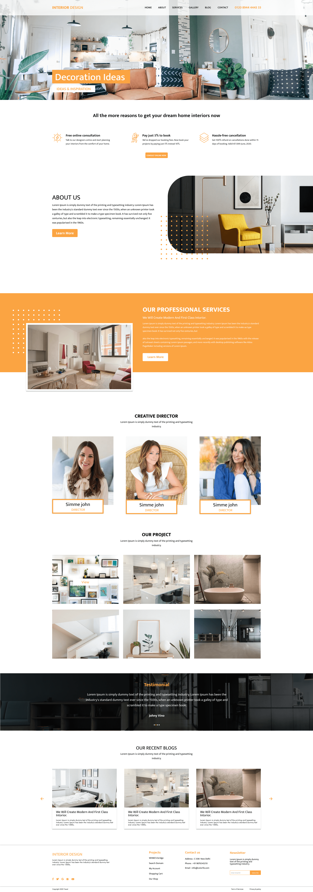

<h1 align="center">Interior Home Design</h1>

<p align="center">	
   <a href="https://www.linkedin.com/in/rafael-goulartb/">
      
   </a>
  <a href="https://github.com/RafaelGoulartB/interior-design-website#readme">
    
  </a>
  <a href="https://github.com/RafaelGoulartB/interior-design-website/graphs/commit-activity">
    
  </a>
  <a href="https://github.com/RafaelGoulartB/interior-design-website/blob/master/LICENSE">
    
  </a>
  
  
</p>

> This a landing page website made for interior home designers made with next.js and chakra ui.


<br />
<div align="center">
  
</div>


---

# :pushpin: Table of Contents

* [Demo Website](#eyes-demo-website)
* [Technologies](#computer-technologies)
* [Features](#rocket-features)
* [How to run](#construction_worker-how-to-run)
* [License](#closed_book-license)

<h2 align="left"> 📥 Layout available at: </h2>
<p align="center">
    <a title="Acess Figma Web" href=https://www.figma.com/file/wzcncKCBHssq9X2gq6aD28/InteriorDesign">
        
    </a>
</p>

# :eyes: Demo Website
👉  demo: https://interior-design-website.vercel.app/

# :computer: Technologies
This project was made using the follow technologies:

* [Next.js](https://nextjs.org/)              
* [Chakra UI](https://chakra-ui.com/)    
* [Vercel](https://vercel.com/)    

# :rocket: Features

- Landing Page
- About us Section
- Galery of Projects
  
# :construction_worker: How to run
### Install Dependencies
```bash
yarn install
```
### Run Aplication
```bash 
yarn dev 
```

Open [http://localhost:3000](http://localhost:3000) with your browser to see the result.
<br>

# :closed_book: License

Released in 2025.
This project is under the [MIT license](./LICENSE).
